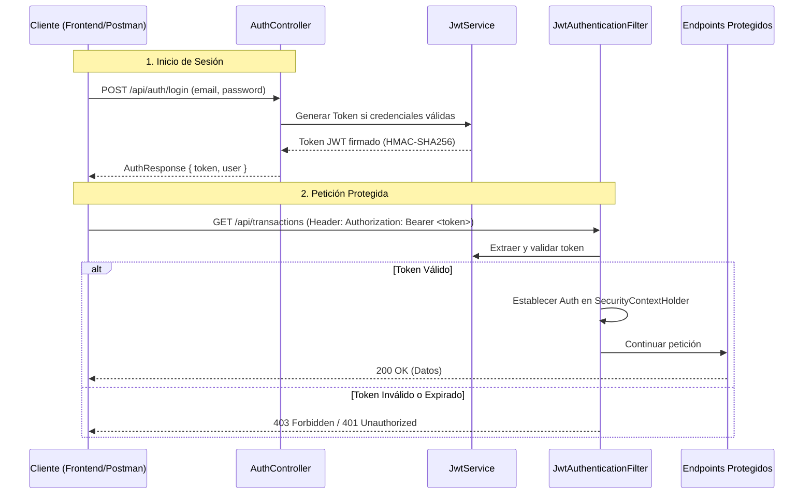

# Documentación de Implementación de JWT (JSON Web Tokens)

Este documento detalla la arquitectura, el flujo de autenticación y los componentes implementados para habilitar la seguridad sin estado (**stateless**) mediante JWT en la API de Fintech.

---

## 1. Arquitectura de Seguridad

La autenticación de la aplicación ha sido migrada de **HTTP Basic** (con estado/basada en sesión básica) a **JWT (stateless)**. 

### Flujo de Autenticación y Autorización


---

## 2. Componentes Clave Creados

### A. Dependencias (`pom.xml`)
Se agregaron las librerías oficiales de **JJWT (Java JWT)** bajo la versión `0.11.5`:
- `jjwt-api`: Interfaz estándar para el manejo de JWTs.
- `jjwt-impl` y `jjwt-jackson` (scope runtime): Proveen la implementación y serialización en formato JSON.

### B. [AuthResponse.java](/backend/src/main/java/com/g9latam/team62/fintech_api/dto/AuthResponse.java)
Modelo `record` que representa la respuesta del inicio de sesión exitoso.
```java
public record AuthResponse(
    String token,
    User user
) {}
```

### C. [CustomUserDetailsService.java](/backend/src/main/java/com/g9latam/team62/fintech_api/security/CustomUserDetailsService.java)
Permite a Spring Security validar el usuario en su base de datos (repositorio en memoria `UserRepository`).
Mapea el usuario de negocio al formato estándar `UserDetails` de Spring Security y asigna el rol por defecto `ROLE_USER`.

### D. [JwtService.java](/backend/src/main/java/com/g9latam/team62/fintech_api/security/JwtService.java)
Lógica central para la manipulación del token:
- **Generación**: Crea el token firmado digitalmente con algoritmo HS256 utilizando un secreto criptográfico de 256 bits (`jwt.secret`).
- **Expiración**: El token expira por defecto en 24 horas (`jwt.expiration`).
- **Validación**: Compara el subject del token con el email del usuario y verifica que la fecha no haya expirado.

### E. [JwtAuthenticationFilter.java](/backend/src/main/java/com/g9latam/team62/fintech_api/security/JwtAuthenticationFilter.java)
Filtro HTTP interceptor (`OncePerRequestFilter`):
1. Extrae el header `Authorization`.
2. Procesa la cadena buscando el prefijo `Bearer `.
3. Valida el token y, de ser correcto, inyecta la autenticación en el `SecurityContextHolder` para habilitar el paso a través de la cadena de filtros de Spring Security.

### F. [SecurityConfig.java](/backend/src/main/java/com/g9latam/team62/fintech_api/config/SecurityConfig.java)
Configuración de seguridad de Spring Boot:
- Deshabilita la protección CSRF (seguro al ser stateless).
- Declara las políticas de creación de sesiones como **STATELESS** (no se almacena estado en el servidor).
- Define las rutas públicas (`/api/auth/**` y `/api/converter/**`) y restringe todas las demás requerindo autenticación.
- Añade el filtro `JwtAuthenticationFilter` antes de la ejecución del filtro por defecto `UsernamePasswordAuthenticationFilter`.

---

## 3. Configuración en `application.properties`

Puedes personalizar la firma y expiración de los tokens agregando estas propiedades en tu archivo de propiedades de Spring Boot:

```properties
# Clave secreta hexadecimal de al menos 256 bits (32 bytes) para firma HMAC-SHA256
jwt.secret=404E635266556A586E3272357538782F413F4428472B4B6250645367566B5970

# Tiempo de expiración del token en milisegundos (ej: 86400000 ms = 24 horas)
jwt.expiration=86400000
```

---

## 4. Guía de Uso del API

### Paso 1: Autenticación (Login)
Realizar una petición `POST` al endpoint público `/api/auth/login`.

**Request Body (`application/json`)**:
```json
{
  "email": "usuario@ejemplo.com",
  "password": "miPasswordSeguro"
}
```

**Response Body (`200 OK`)**:
```json
{
  "token": "eyJhbGciOiJIUzI1NiJ9.eyJzdWIiOiJ1c3VhcmlvQGVqZW1wbG8uY29tIiwiaWF0IjoxNzAyODUyNjAwLCJleHAiOjE3MDI5Mzk... ",
  "user": {
    "id": 1,
    "name": "Usuario Ejemplo",
    "email": "usuario@ejemplo.com",
    "monthlyIncome": 3500.00,
    "savingFrequency": "MONTHLY"
  }
}
```

### Paso 2: Consumir un Endpoint Protegido
Para cualquier petición subsecuente a una ruta protegida (por ejemplo, `GET /api/transactions`), se debe adjuntar el token obtenido en el encabezado `Authorization`:

**Headers**:
```http
Authorization: Bearer <TOKEN_JWT_OBTENIDO>
```
