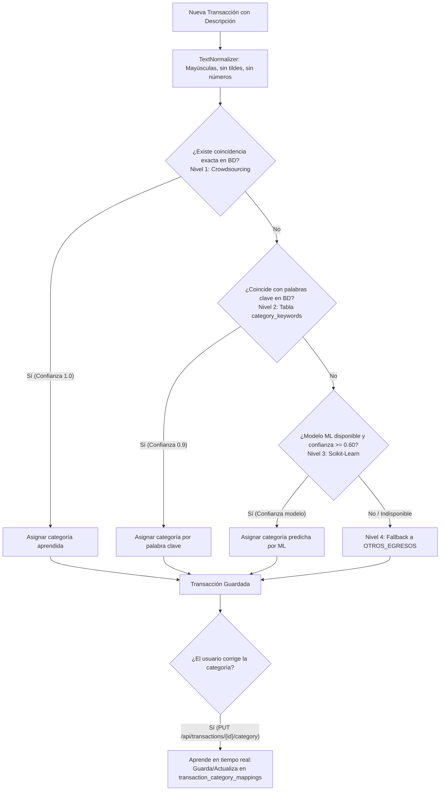

# Finance AI — Asistente Inteligente de Salud Financiera

Proyecto desarrollado en el marco del **Hackathon ONE G9** organizado por Alura Latam y Oracle.

---

## Descripción

Finance AI es una solución inteligente que analiza el comportamiento financiero de un usuario a partir de sus transacciones e información financiera, transformando datos en bruto en conocimiento útil y accionable.

El sistema recibe información relacionada con gastos, ingresos y hábitos financieros, y devuelve una evaluación completa del perfil financiero del usuario junto con recomendaciones personalizadas.

---

## Funcionalidades principales

- **Clasificación automática jerárquica de 4 niveles** para transacciones financieras.
- **Aprendizaje colaborativo (Crowdsourcing / Retroalimentación)** mediante actualización en tiempo real de reglas por corrección de usuarios.
- **Administración dinámica de palabras clave en base de datos** para reglas de clasificación sin necesidad de redesplegar.
- **Análisis del perfil financiero** del usuario (`SAVER`, `BALANCED`, `SPENDER`, `AT_RISK`).
- **Generación de recomendaciones** personalizadas y reportes de sobregasto.
- **Conversión y extracción de cartolas bancarias** (PDF, Excel, CSV) e ingesta automática a la base de datos a través de un analizador CLI en Python integrado en el backend.
- **API REST documentada con Swagger/OpenAPI** y asegurada con JWT de expiración optimizada (10 minutos).

### 🛡️ Seguridad del API & Defensa en Profundidad:
- **Protección contra ataques de Fuerza Bruta:** Bloqueo temporal automático de cuentas por 15 minutos tras 5 intentos fallidos consecutivos de inicio de sesión.
- **Validación de Propiedad de Recursos (Mitigación IDOR / BOLA):** Chequeo estricto a nivel de controlador para asegurar que los usuarios autenticados únicamente puedan consultar, crear, modificar o eliminar sus propios recursos (perfiles, transacciones y recomendaciones).
- **Validación de Archivos por Magic Bytes:** Verificación del tipo MIME real analizando los bytes de cabecera (*Magic Bytes* / firmas de archivos) al subir cartolas en PDF, Excel o CSV, bloqueando payloads gigantes (2MB máx) y archivos ejecutables maliciosos renombrados.
- **Cabeceras de Seguridad HTTP:** Configuración de cabeceras seguras (HSTS, X-Content-Type-Options para mitigar MIME sniffing, X-Frame-Options para prevenir Clickjacking y protección básica de XSS).
- **CORS Preflight Bypass:** Interceptor global configurado para omitir peticiones de rate-limit en solicitudes `OPTIONS`, permitiendo un preflight limpio para el frontend.

---

## 🏗️ Motor de Clasificación Jerárquico (4 Niveles)

El sistema procesa cada descripción de transacción bancaria mediante una cadena jerárquica de mayor a menor precisión:



### Detalle de los 4 Niveles:

1. **Nivel 1 — Mapeo Colaborativo (`transaction_category_mappings`):** Busca coincidencia exacta con patrones previamente corregidos y confirmados por los usuarios. Si existe, asigna la categoría con nivel de confianza `1.0`.
2. **Nivel 2 — Reglas por Palabras Clave (`category_keywords`):** Compara el texto normalizado contra un diccionario de palabras clave almacenado en la base de datos (pre-cargado con marcas y servicios comunes en Latam/Chile como Jumbo, Metro, Enel, Uber, etc.). Asigna la categoría con nivel de confianza `0.9`.
3. **Nivel 3 — Modelo ML (`MlInferenceService`):** Invoca el modelo de clasificación supervisada desarrollado por el equipo de Ciencia de Datos cuando la confianza sea $\ge 0.60$.
4. **Nivel 4 — Fallback:** Si ningún nivel anterior coincide, asigna por defecto `OTHER_EXPENSE` (Otros Egresos).

---

## 🔄 Ciclo de Retroalimentación y Aprendizaje

Cuando un usuario detecta que la categoría sugerida no es correcta, puede enviar una corrección a través del endpoint de la API:

`PUT /api/transactions/{id}/category`

```json
{
  "category": "FOOD"
}
```

Al recibir la corrección:
1. Se actualiza la categoría de la transacción correspondiente.
2. Se ejecuta `learnFromFeedback()`, actualizando o insertando el patrón en `transaction_category_mappings` y aumentando su contador de frecuencia.
3. Futuras subidas de cartolas o registro de transacciones con esa misma descripción serán clasificadas instantáneamente en el **Nivel 1**.

---

## 🛠️ Normalización de Texto (`TextNormalizer`)

Antes de ser evaluada por cualquiera de los niveles, la descripción de la transacción pasa por un proceso de homogeneización:
- Conversión a mayúsculas.
- Eliminación de acentos y caracteres diacríticos (`á` $\rightarrow$ `A`, `ñ` $\rightarrow$ `N`).
- Eliminación de números, RUTs, fechas y códigos de sucursales o transferencias.
- Eliminación de caracteres especiales.
- Colapso de múltiples espacios a un solo espacio.

*Ejemplo:* `"COMPRA JUMBO PROVIDENCIA 1234"` $\rightarrow$ `"COMPRA JUMBO PROVIDENCIA"`

---

## Stack tecnológico

| Área | Tecnologías |
|---|---|
| Back-End | Java 17, Spring Boot 3 (Spring Security, JWT), Maven |
| Base de Datos | H2 (Pruebas locales) / Oracle Autonomous Database (Producción ATP over wallet) |
| Documentación API | Springdoc OpenAPI (Swagger UI en `/swagger-ui.html`) |
| Ciencia de Datos | Python, Scikit-Learn, Pandas, Jupyter |
| Infraestructura | OCI Object Storage, OCI Container Instances, Docker |

---

## Estructura del repositorio

```
finance-ai/
├── docs/               # Documentación del proyecto y decisiones de arquitectura
├── data-science/       # Dataset, notebooks de EDA, entrenamiento y modelos serializados
├── backend/            # API REST Spring Boot
├── frontend/           # Interfaz de usuario
└── infra/              # Configuración Docker y OCI
```

```bash
# Ejemplo de subida e ingesta directa de cartola mediante la API REST
curl.exe -X POST "http://localhost:8080/api/transactions/upload-statement" \
  -H "Authorization: Bearer <TOKEN_JWT>" \
  -F "file=@..\Cartola CuentaRUT 20260523_000002.pdf" \
  -F "userId=1" \
  -F "defaultYear=2026" \
  -F "country=CL"
```

---

## Endpoints de Transacciones

- `GET /api/transactions` — Listar transacciones (filtro opcional por `userId`)
- `GET /api/transactions/{id}` — Consultar transacción por ID
- `POST /api/transactions` — Crear transacción con auto-clasificación inteligente
- `PUT /api/transactions/{id}` — Actualización completa de la transacción
- `PUT /api/transactions/{id}/category` — Corrección de categoría y retroalimentación de aprendizaje
- `DELETE /api/transactions/{id}` — Eliminar transacción

---

## Despliegue

`.github/workflows/ci-cd.yml` construye las imágenes de `backend/` y `frontend/`, las publica en GHCR
en cada push a `main` y luego, en un runner *self-hosted*, levanta la nueva versión con Docker Compose.

### Configuración en el servidor

Las credenciales —contraseña de la base de datos y wallet de Oracle— **no viven en el repositorio**:
se dejan una sola vez en el servidor, en un directorio propio **fuera del workspace del runner**:

```
/opt/financeai/
├── .env                 # copia de .env.example, ya completada
└── secrets/wallet/      # wallet de Autonomous Database, descomprimido
    ├── cwallet.sso
    ├── ewallet.p12
    ├── tnsnames.ora
    └── sqlnet.ora
```

> **No poner el `.env` en el directorio donde el runner hace el checkout.** `actions/checkout` limpia
> el workspace con `git clean -ffdx`, y el flag `-x` incluye los archivos ignorados: el `.env` y el
> wallet se borrarían en cada despliegue.

Preparación, una sola vez en el servidor:

```bash
sudo mkdir -p /opt/financeai/secrets/wallet
sudo chown -R <usuario-del-runner> /opt/financeai

# copiar .env.example del repositorio a /opt/financeai/.env y completarlo,
# y descomprimir ahí el wallet descargado desde OCI
chmod 750 /opt/financeai
chmod 600 /opt/financeai/.env             # lo lee el CLI de Docker, como el usuario del runner
chmod 755 /opt/financeai/secrets/wallet   # lo lee el proceso dentro del contenedor
chmod 644 /opt/financeai/secrets/wallet/*
```

El wallet no puede quedar en `600`: el contenedor corre como el usuario `spring` (ver
`backend/Dockerfile`) y los *bind mounts* no traducen uids, así que un archivo de `ubuntu`
en modo `600` es ilegible dentro del contenedor y la conexión falla. La protección real la
da el directorio padre en `750`: ningún otro usuario del servidor puede entrar a
`/opt/financeai`, mientras que el montaje lo hace el demonio de Docker como root.

El job de despliegue copia el `docker-compose.yml` del repositorio a ese directorio y ejecuta Compose
desde allí, de modo que Compose carga el `.env` automáticamente (lo lee del directorio del proyecto)
y el montaje relativo `./secrets/wallet` resuelve a `/opt/financeai/secrets/wallet`. Los cambios en
`docker-compose.yml` se siguen desplegando normalmente, porque el archivo se copia desde el repo en
cada ejecución. Mientras `/opt/financeai` no exista, el despliegue continúa desde el workspace y deja
un *warning* en el log.

### Activar Oracle

Mientras `SPRING_PROFILES_ACTIVE` no sea `oracle`, el backend arranca con H2 en memoria y
**los datos se pierden en cada despliegue**. Para persistir en Autonomous Database:

1. Aprovisionar la instancia y crear el esquema — ver [backend/README.md → Base de datos](backend/README.md#base-de-datos).
2. Dejar el wallet descomprimido en `/opt/financeai/secrets/wallet/`.
3. En `/opt/financeai/.env`: `SPRING_PROFILES_ACTIVE=oracle`, `ORACLE_DB_PASSWORD=...` y el alias `_tp`
   correcto en `ORACLE_JDBC_URL`.
4. Volver a desplegar: push a `main`, o `docker compose up -d` desde `/opt/financeai`.

### Migración desde el workspace del runner

Si ya había contenedores levantados desde el directorio del checkout, hay que retirarlos una vez.
El nombre del proyecto de Compose viene del nombre del directorio, así que los contenedores antiguos
no se adoptan y chocan por `container_name`:

```bash
cd <workspace-antiguo> && docker compose down
# o, directamente: docker rm -f fintech-api fintech-frontend
```

### En local

Para levantar la misma pila en la máquina de desarrollo, el `.env` y `secrets/wallet/` van en la raíz
del repositorio (ambos están en `.gitignore`) y basta con `docker compose up -d`.

---

## Categorías de clasificación

Las transacciones son clasificadas automáticamente en las siguientes categorías:

- Alimentación
- Transporte
- Salud
- Vivienda
- Educación
- Ocio
- Servicios

El perfil financiero del usuario se clasifica en: **Saludable**, **En observación** o **En riesgo**.

---

## Estado del proyecto

Proyecto en desarrollo activo — Semana 1 de 6.

---

## Programa

**ONE (Oracle Next Education)** — Hackathon Proyectos G9  
Organizado por Alura Latam y Oracle
