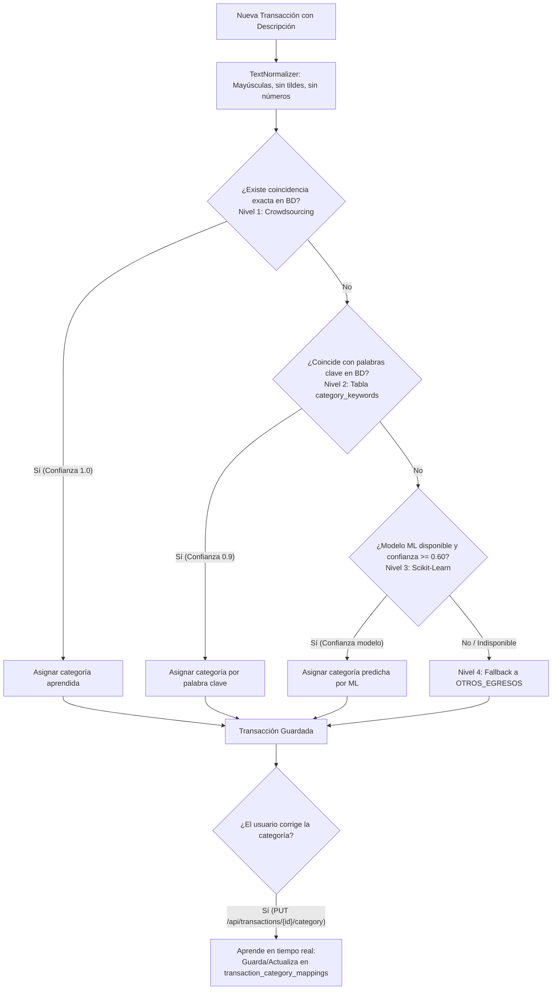

# Finance AI — Asistente Inteligente de Salud Financiera

Proyecto desarrollado en el marco del **Hackathon ONE G9** organizado por Alura Latam y Oracle.

---

## Descripción

Finance AI es una solución inteligente que analiza el comportamiento financiero de un usuario a partir de sus transacciones e información financiera, transformando datos en bruto en conocimiento útil y accionable.

El sistema recibe información relacionada con gastos, ingresos y hábitos financieros, y devuelve una evaluación completa del perfil financiero del usuario junto con recomendaciones personalizadas.

---

## Funcionalidades principales

- **Clasificación automática jerárquica de 4 niveles** para transacciones financieras
- **Aprendizaje colaborativo (Crowdsourcing / Retroalimentación)** mediante actualización en tiempo real de reglas por corrección de usuarios
- **Administración dinámica de palabras clave en base de datos** para reglas de clasificación sin necesidad de redesplegar
- **Análisis del perfil financiero** del usuario (`SAVER`, `BALANCED`, `SPENDER`, `AT_RISK`)
- **Generación de recomendaciones** personalizadas
- **Conversión y extracción de cartolas bancarias** desde PDF a Excel
- **API REST documentada con Swagger/OpenAPI** y asegurada con JWT

---

## 🏗️ Motor de Clasificación Jerárquico (4 Niveles)

El sistema procesa cada descripción de transacción bancaria mediante una cadena jerárquica de mayor a menor precisión:



### Detalle de los 4 Niveles:

1. **Nivel 1 — Mapeo Colaborativo (`transaction_category_mappings`):** Busca coincidencia exacta con patrones previamente corregidos y confirmados por los usuarios. Si existe, asigna la categoría con nivel de confianza `1.0`.
2. **Nivel 2 — Reglas por Palabras Clave (`category_keywords`):** Compara el texto normalizado contra un diccionario de palabras clave almacenado en la base de datos (pre-cargado con marcas y servicios comunes en Latam/Chile como Jumbo, Metro, Enel, Uber, etc.). Asigna la categoría con nivel de confianza `0.9`.
3. **Nivel 3 — Modelo ML (`MlInferenceService`):** Invoca el modelo de clasificación supervisada desarrollado por el equipo de Ciencia de Datos cuando la confianza sea $\ge 0.60$.
4. **Nivel 4 — Fallback:** Si ningún nivel anterior coincide, asigna por defecto `OTHER_EXPENSE` (Otros Egresos).

---

## 🔄 Ciclo de Retroalimentación y Aprendizaje

Cuando un usuario detecta que la categoría sugerida no es correcta, puede enviar una corrección a través del endpoint de la API:

`PUT /api/transactions/{id}/category`

```json
{
  "category": "FOOD"
}
```

Al recibir la corrección:
1. Se actualiza la categoría de la transacción correspondiente.
2. Se ejecuta `learnFromFeedback()`, actualizando o insertando el patrón en `transaction_category_mappings` y aumentando su contador de frecuencia.
3. Futuras subidas de cartolas o registro de transacciones con esa misma descripción serán clasificadas instantáneamente en el **Nivel 1**.

---

## 🛠️ Normalización de Texto (`TextNormalizer`)

Antes de ser evaluada por cualquiera de los niveles, la descripción de la transacción pasa por un proceso de homogeneización:
- Conversión a mayúsculas.
- Eliminación de acentos y caracteres diacríticos (`á` $\rightarrow$ `A`, `ñ` $\rightarrow$ `N`).
- Eliminación de números, RUTs, fechas y códigos de sucursales o transferencias.
- Eliminación de caracteres especiales.
- Colapso de múltiples espacios a un solo espacio.

*Ejemplo:* `"COMPRA JUMBO PROVIDENCIA 1234"` $\rightarrow$ `"COMPRA JUMBO PROVIDENCIA"`

---

## Stack tecnológico

| Área | Tecnologías |
|---|---|
| Back-End | Java 21, Spring Boot 4.1, Spring Security, JWT, Apache PDFBox, Apache POI |
| Base de Datos | H2 (Pruebas locales) / Oracle Autonomous Database (Producción) |
| Documentación API | Springdoc OpenAPI (Swagger UI en `/swagger-ui.html`) |
| Ciencia de Datos | Python, Scikit-Learn, Pandas |

---

## Endpoints de Transacciones

- `GET /api/transactions` — Listar transacciones (filtro opcional por `userId`)
- `GET /api/transactions/{id}` — Consultar transacción por ID
- `POST /api/transactions` — Crear transacción con auto-clasificación inteligente
- `PUT /api/transactions/{id}` — Actualización completa de la transacción
- `PUT /api/transactions/{id}/category` — Corrección de categoría y retroalimentación de aprendizaje
- `DELETE /api/transactions/{id}` — Eliminar transacción

---

## Programa

**ONE (Oracle Next Education)** — Hackathon Proyectos G9  
Organizado por Alura Latam y Oracle
