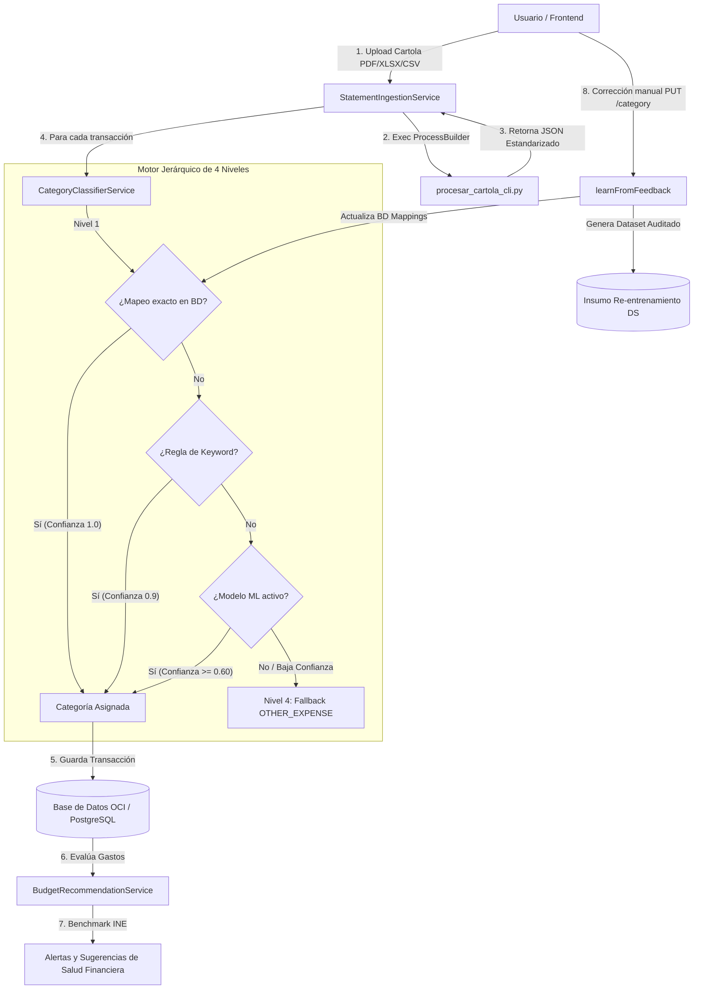

# 🤖 Finance AI — Documentación de Integración Backend & Data Science

**Proyecto:** Finance AI — Hackathon G9 LATAM  
**Componente:** Backend & Data Science Workflow (`fintech-api` + Python CLI & ML Model)  
**Idioma:** Español  

---

## 📌 Visión General

El sistema **Finance AI** une la potencia de un backend en **Spring Boot (Java 21)** con módulos avanzados de **Ciencia de Datos y Machine Learning (Python)**. 

Esta integración abarca **cuatro pilares fundamentales**:
1. **Ingesta Automatizada de Cartolas Bancarias**: Invocación desde Java mediante `ProcessBuilder` a un ejecutable CLI de Python que normaliza y extrae transacciones de archivos complejos (`.pdf`, `.xlsx`, `.xls`, `.csv`).
2. **Motor Jerárquico de Clasificación de 4 Niveles**: Una arquitectura híbrida que combina coincidencia colaborativa rápida (DB), reglas heurísticas de palabras clave, inferencia con modelos supervisados de Machine Learning y fallback inteligente.
3. **Ciclo de Aprendizaje Continuo (Feedback Loop)**: Retroalimentación en tiempo real cuando el usuario corrige manualmente una categoría, actualizando la BD de inmediato y generando datasets auditables para el reentrenamiento futuro de los modelos.
4. **Motor de Recomendaciones Presupuestarias (Data Analytics INE Chile)**: Análisis estadístico contra las encuestas de presupuestos familiares del INE y filtrado de transferencias internas para calcular la salud financiera del usuario.

---

## 🏗️ Arquitectura General de Integración



---

## 🛠️ 1. Ingesta Automatizada de Cartolas (`procesar_cartola_cli.py`)

Para evitar procesar la diversidad de formatos de cartolas bancarias en Java, se utiliza un script robusto en **Python** como subproceso.

### Flujo de Ejecución Backend $\rightarrow$ Python CLI
1. El endpoint `POST /api/transactions/upload-statement` recibe el archivo subido por el usuario.
2. `StatementIngestionService` crea un archivo temporal seguro en disco (`cartola_XXXX.pdf`).
3. Ejecuta mediante `ProcessBuilder` el script:
   ```bash
   python backend/scripts/procesar_cartola_cli.py <ruta_temporal> --anio-defecto 2026 --pais CL
   ```
4. El script de Python:
   - Identifica la estructura del banco origen (`BANCO_CHILE`, `SANTANDER`, `CUENTA_RUT`, `FALABELLA`, `MERCADO_PAGO`, `BCI`, `ITAU`, `SCOTIABANK`).
   - Reconstruye tablas en PDF usando `pdfplumber` (revisión de bordes vectoriales y posición de palabras) o parsing tabular en Excel/CSV mediante `pandas`.
   - Limpia montos (paréntesis contables, signos, comas/puntos) y detecta fechas y días festivos (`holidays`).
   - Emite por `stdout` un JSON estandarizado con el estado (`status: ok`) y el listado de filas parseadas.
5. Java lee `stdout`, elimina el archivo temporal de forma garantizada y transfiere los datos al motor de clasificación.

---

## 🎯 2. Motor Jerárquico de Clasificación (4 Niveles)

El sistema combina la velocidad de búsqueda indexada con la flexibilidad predictiva del Machine Learning.

| Nivel | Componente / Mecanismo | Origen | Descripción / Criterio | Confianza |
| :---: | :--- | :---: | :--- | :---: |
| **Nivel 1** | **Crowdsourcing (BD)** | Backend | Coincidencia exacta con patrones en `transaction_category_mappings` aprendidos por correcciones humanas previas. | `1.0` (`BD_MAPPING`) |
| **Nivel 2** | **Reglas de Keywords (BD)** | Backend | Búsqueda de palabras clave estratégicas en `category_keywords` (ej: "JUMBO" $\rightarrow$ `FOOD`, "UBER" $\rightarrow$ `TRANSPORT`). | `0.9` (`KEYWORD_RULE`) |
| **Nivel 3** | **Modelo de ML Supervisado** | Data Science | Consulta al microservicio / API REST de Ciencia de Datos (`MlInferenceService`) utilizando un modelo supervisado (ej: Scikit-learn / XGBoost). | Variable (`>= 0.60`) (`ML_MODEL`) |
| **Nivel 4** | **Fallback Jerárquico** | Backend | Categoría por defecto (`OTHER_EXPENSE` u `OTHER_INCOME`) cuando ningún nivel anterior tuvo suficiente confianza. | `0.0` (`FALLBACK`) |

---

## 🔄 3. Ciclo de Aprendizaje Continuo (Feedback Loop)

El modelo no se mantiene estático. Cuando un usuario visualiza sus transacciones en el frontend y decide corregir una categoría asignada:

1. El cliente ejecuta `PUT /api/transactions/{id}/category` enviando la nueva categoría deseada.
2. `TransactionService` procesa la petición e invoca a `CategoryClassifierService.learnFromFeedback(description, newCategory)`.
3. **Efectos Inmediatos & Trazables**:
   - **Efecto Inmediato**: Se inserta o incrementa la frecuencia del patrón en `transaction_category_mappings`. Desde ese instante, cualquier transacción idéntica subida por cualquier usuario se clasificará instantáneamente en Nivel 1.
   - **Trazabilidad de Re-entrenamiento**: La transacción conserva el registro de la categoría predicha por el modelo (`categoria_modelo`), la asignada finalmente por el usuario (`categoria_usuario`) y la confianza inicial, quedando disponible en el dataset para el próximo ciclo de entrenamiento del modelo de Data Science.

---

## 📊 4. Analítica y Recomendaciones Presupuestarias (INE Chile)

El módulo `BudgetRecommendationService` aplica métricas estadísticas sobre los gastos clasificados:

1. **Benchmarking Gubernamental**: Compara las proporciones mensuales de consumo del usuario contra la **IX Encuesta de Presupuestos Familiares del INE (Chile)**.
2. **Filtrado Inteligente de Ruido**: Excluye transferencias internas (`TEF`, `GIRO`, `TRANSF`, `PAGO DE TARJETA`) para evitar sesgar el gasto de consumo real.
3. **Cálculo de Tasa de Ahorro**: Evalúa la capacidad de ahorro del período comparándola contra el objetivo recomendado (20%).
4. **Control de Cooldown**: Limita la generación de recomendaciones a un máximo de 3 sugerencias por ejecución con un período de enfriamiento de 7 días entre evaluaciones.

---

## ⚙️ 5. Requisitos y Configuración del Entorno

### Dependencias de Python (`requirements.txt`)
Las librerías de Python requeridas para ejecutar la ingesta y soporte de Data Science se encuentran en `requirements.txt`:

```txt
pdfplumber
pandas
numpy
openpyxl
holidays
```

Para instalarlas en el entorno de desarrollo:
```bash
pip install -r requirements.txt
```

### Propiedades de Conexión en Spring Boot (`application.properties`)
Para habilitar o configurar el endpoint de inferencia del equipo de Data Science (Nivel 3):

```properties
# Habilitación del servicio de inferencia de Machine Learning
ml.inference.enabled=true
ml.inference.url=http://localhost:8000/predict
ml.inference.min-confidence=0.60
```

---

## 📂 Archivos Relacionados en el Repositorio

- 📜 [procesar_cartola_cli.py](backend/scripts/procesar_cartola_cli.py): Script CLI principal de ingesta de cartolas.
- ☕ [StatementIngestionService.java](backend/src/main/java/com/g9latam/team62/fintech_api/service/StatementIngestionService.java): Servicio de orquestación de llamadas a Python.
- ☕ [CategoryClassifierService.java](backend/src/main/java/com/g9latam/team62/fintech_api/service/CategoryClassifierService.java): Motor jerárquico de 4 niveles y función `learnFromFeedback`.
- ☕ [MlInferenceService.java](backend/src/main/java/com/g9latam/team62/fintech_api/service/MlInferenceService.java): Cliente REST para consultar la API de Machine Learning.
- ☕ [BudgetRecommendationService.java](backend/src/main/java/com/g9latam/team62/fintech_api/service/BudgetRecommendationService.java): Motor de sugerencias basado en datos estadísticos del INE.
- 📝 [requirements.txt](requirements.txt): Requerimientos de paquetes de Python.
