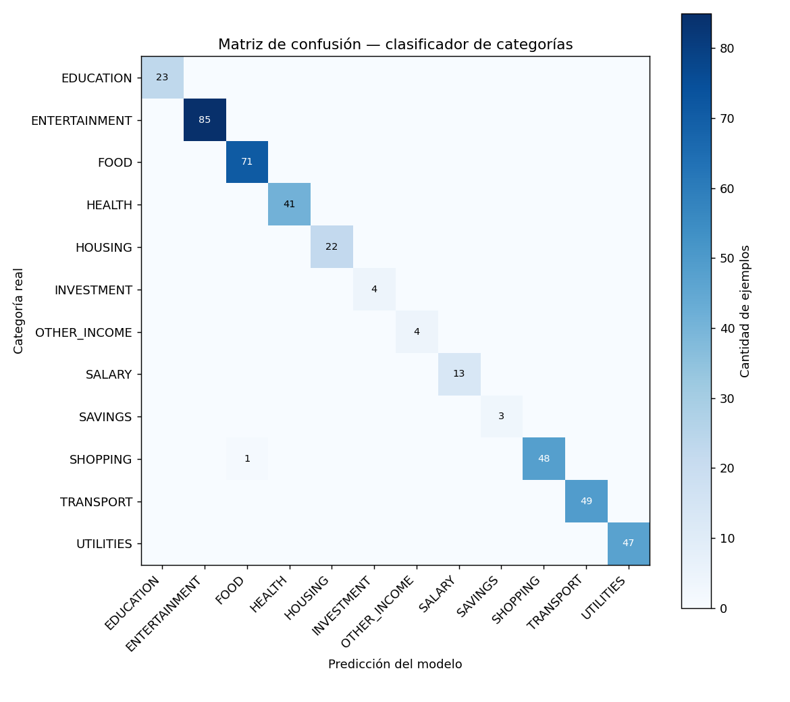

# Reporte de Evaluación — Modelo de Clasificación (Nivel 3)

**Entregable:** cumple el requisito obligatorio del brief ("entrenamiento y evaluación de modelos", "métricas de rendimiento adecuadas", "serialización de los modelos").

---

## 1. Qué se entrenó

**TF-IDF (uni+bigramas) + Regresión Logística multiclase**, sobre 2,051 ejemplos de texto normalizado, en 12 categorías. Se eligió este enfoque sobre alternativas más pesadas (embeddings, redes neuronales) a propósito: para texto corto de comercios, es un estándar efectivo, entrena en segundos, pesa poco (importa para el contenedor Docker), y da probabilidades calibradas de forma nativa — exactamente lo que pide el contrato de confianza con Backend (`ml.inference.min-confidence=0.60`).

## 2. De dónde salieron los datos de entrenamiento

| Fuente | Cantidad | Detalle |
|---|---|---|
| `category_mappings` + `category_keywords` reales de Backend | 398 pares | Comercios chilenos reales, ya en producción (Jumbo, Copec, Enel, Falabella, etc.) |
| Comercios del dataset simulado propio | 35 pares | Variedad adicional |
| **Aumentación** (prefijos/sufijos realistas: "COMPRA X", "PAGO X", "X PROVIDENCIA") | → 2,051 filas finales | Simula cómo aparece el texto en una cartola real, no solo el nombre limpio del comercio |

**Preprocesamiento:** réplica exacta de `TextNormalizer.java` (mayúsculas, sin tildes, sin números/códigos) — el modelo entrena sobre la misma distribución de texto que va a ver en producción.

## 3. Métricas — con una advertencia honesta

| Métrica | Valor |
|---|---|
| Accuracy (split de test) | 99.8% |
| F1 macro | 0.999 |
| F1 weighted | 0.998 |

**Esta cifra es engañosamente alta si se toma sola.** El split de test sale de la misma familia de comercios que el entrenamiento (mismas bases, distintas combinaciones de prefijo/sufijo) — mide que el modelo aprendió bien los patrones de aumentación, no necesariamente que generaliza a comercios que nunca vio. La prueba que sí importa es la siguiente.

### Prueba real de generalización — comercios nunca vistos en el entrenamiento

| Descripción | Predicción | Confianza | ¿Correcto? |
|---|---|---|---|
| COMPRA JUMBO PROVIDENCIA 1234 | FOOD | 0.79 | ✅ |
| PAGO UBER TRIP 88291 | TRANSPORT | 0.52 | ✅ (bajo el umbral 0.60 → cae a fallback igual) |
| NETFLIX COM SUSCRIPCION | ENTERTAINMENT | 0.84 | ✅ |
| FARMACIA CRUZ VERDE LAS CONDES | HEALTH | 0.93 | ✅ |
| TEF A CTA 12.345.678-9 | FOOD | 0.19 | ❌, pero confianza muy baja |
| PAGO GASTO COMUN EDIFICIO | HOUSING | 0.97 | ✅ |

**El caso interesante es el de la transferencia (TEF):** el modelo se equivoca, pero con solo 19% de confianza — muy por debajo del umbral de 0.60 que definió Backend. El propio mecanismo de confianza filtra el error sin que nosotros tengamos que hacer nada extra. Es la validación de que el diseño del pipeline híbrido (con el umbral como red de seguridad) funciona como se pensó.

## 4. Matriz de confusión (sobre el split de test)



## 5. Limitaciones conocidas

- **`OTHER_EXPENSE` no tiene ejemplos de entrenamino propios** — es la categoría fallback por diseño (nadie etiqueta algo como "otro gasto" a propósito). Esto es intencional: confiamos en que el umbral de confianza (0.60) capture los casos ambiguos y los deje caer al fallback, en vez de forzar al modelo a "inventar" qué es un gasto genérico.
- **Categorías con pocos ejemplos** (`SAVINGS`: 15, `INVESTMENT`: 19, `OTHER_INCOME`: 20) — funcionan bien en las pruebas, pero con ese volumen el modelo es más frágil ante variedad de texto que no haya visto. Quedan como candidatas a reforzar si aparecen datos reales de usuarios con ese patrón de gasto.
- **La aumentación es una aproximación**, no texto real de cartola. La prueba real de fondo va a ser cómo se comporta contra transacciones reales de usuarios una vez desplegado — recomendamos revisar el % de `FALLBACK` en el resumen de explicabilidad (ver `explicabilidad_resumen.py`) las primeras semanas, como señal temprana de si el modelo necesita más datos.

## 6. Archivos de esta entrega

```
ml-model/
├── 01_construir_dataset.py      # arma el dataset combinado (reproducible)
├── 02_entrenar_evaluar.py       # entrena, evalúa, serializa
├── servicio_inferencia.py       # FastAPI, expone POST /predict
├── modelo_clasificador.joblib   # el modelo entrenado y serializado
├── dataset_entrenamiento.csv    # el dataset final usado
├── reporte_evaluacion.json      # métricas completas en JSON
├── matriz_confusion.png
├── explicabilidad_resumen.py    # Bloque 2, ítem 2
├── requirements.txt
└── Dockerfile
```

## 7. Cómo levantarlo

```bash
cd ml-model
pip install -r requirements.txt
uvicorn servicio_inferencia:app --host 0.0.0.0 --port 8000
```

Y en `application.properties` de Backend:

```properties
ml.inference.enabled=true
ml.inference.url=http://localhost:8000/predict
```

Verificación rápida: `curl http://localhost:8000/health` → `{"status":"ok","model_loaded":true}`.
