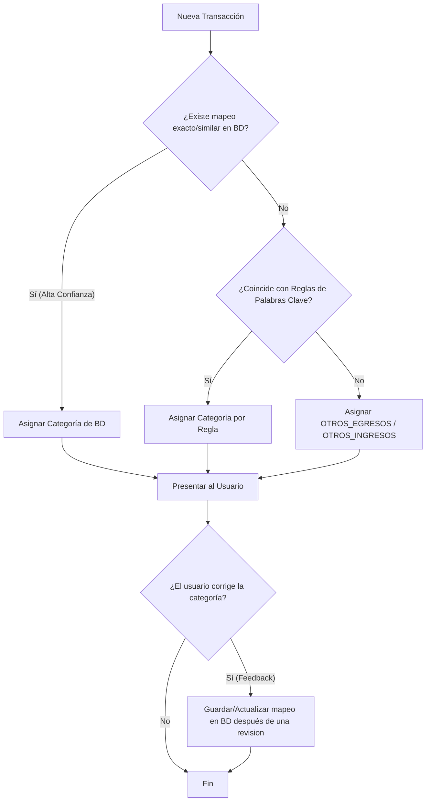

Mi propuesta es combinar **correlación por palabras clave** con un **sistema de feedback de los usuarios (aprendizaje colaborativo)**, ya que es un enfoque híbrido muy utilizado y altamente efectivo para resolver este problema sin tener que recurrir obligatoriamente a complejos modelos de Inteligencia Artificial (o como paso previo/base para entrenar uno en el futuro).

---

### 1. El Flujo de Clasificación Híbrido

Cuando el sistema procesa una transacción (ya sea mediante la subida de una cartola o creación manual), la clasificación pasa por tres niveles de decisión (de mayor a menor precisión):



---

### 2. Diseño de la Base de Datos

Para soportar este comportamiento, podemos crear una tabla de **Mapeos de Categorías**. Esto guardará la asociación de descripciones de transacciones (simplificadas) con sus respectivas categorías.

```sql
CREATE TABLE transaction_category_mappings (
    id BIGINT GENERATED BY DEFAULT AS IDENTITY PRIMARY KEY,
    description_pattern VARCHAR(255) NOT NULL UNIQUE, -- La descripción normalizada
    category VARCHAR(50) NOT NULL,                    -- Categoría asociada (Ej: FOOD, TRANSPORT)
    frequency INT DEFAULT 1                           -- Opcional: Contador de veces que se ha clasificado así
);
```
> [!TIP]
> **¿Por qué un contador de frecuencia?** 
> Si múltiples usuarios clasifican `COMPRA JUMBO` como `FOOD` (Alimentación), la frecuencia sube. Si alguien por error lo cambia, la frecuencia te permite mantener la clasificación de la mayoría (consenso colaborativo o *crowdsourcing*).

---

### 3. Implementación en el Backend (Spring Boot)

#### A. Normalización de Descripciones
Las cartolas suelen incluir datos variables en la descripción (fechas, números de transacción, sucursales, etc.). Por ejemplo: `COMPRA JUMBO BILBAO 1234` o `COMPRA JUMBO PROVIDENCIA 5678`.
Antes de buscar en la base de datos o aplicar reglas, es vital **limpiar y normalizar** el texto:
* Convertir a mayúsculas.
* Quitar tildes y caracteres especiales.
* Eliminar números, fechas o códigos transaccionales que varíen.
* Colapsar espacios múltiples.
* De esta forma, ambas descripciones anteriores se normalizan a: `COMPRA JUMBO`.

#### B. El Motor de Reglas Estáticas (Palabras Clave)
Podemos definir un diccionario de palabras clave iniciales en el código o en propiedades. Por ejemplo:

```java
public enum CategoryRule {
    FOOD(List.of("JUMBO", "LIDER", "TOTTUS", "UNIMARC", "MCDONALDS", "PEDIDOSYA", "CORNERshop"), Category.FOOD),
    TRANSPORT(List.of("METRO", "BIP", "UBER", "CABIFY", "DIDI", "COPEC", "SHELL"), Category.TRANSPORT),
    UTILITIES(List.of("ENEL", "AGUAS ANDINAS", "VTR", "MOVISTAR", "CLARO", "ENTEL"), Category.UTILITIES),
    HEALTH(List.of("CRUZ VERDE", "AHUMADA", "SALCOBRAND", "CLINICA", "MEDICO"), Category.HEALTH),
    HOUSING(List.of("GC", "GASTO COMUN", "PORTALINMOBILIARIO"), Category.HOUSING),
    EDUCATION(List.of("COLEGIO", "UNIVERSIDAD", "DUOC", "INACAP", "UDEMY", "COURSERA"), Category.EDUCATION),
    ENTERTAINMENT(List.of("NETFLIX", "SPOTIFY", "DISNEY+", "YOUTUBE PREMIUM", "CINE"), Category.ENTERTAINMENT);

    private final List<String> keywords;
    private final Category category;

    CategoryRule(List<String> keywords, Category category) {
        this.keywords = keywords;
        this.category = category;
    }

    public static Category match(String normalizedDescription) {
        for (CategoryRule rule : values()) {
            for (String keyword : rule.keywords) {
                if (normalizedDescription.contains(keyword)) {
                    return rule.category;
                }
            }
        }
        return null;
    }
}
```

#### C. Lógica del Servicio de Clasificación
Creamos un servicio que aplique la jerarquía de clasificación cuando llega una transacción:

```java
@Service
public class CategoryClassifierService {

    private final CategoryMappingRepository mappingRepository;

    public CategoryClassifierService(CategoryMappingRepository mappingRepository) {
        this.mappingRepository = mappingRepository;
    }

    public Category classify(String rawDescription) {
        if (rawDescription == null || rawDescription.isBlank()) {
            return Category.OTHER_EXPENSE; // O el default que corresponda
        }

        // 1. Normalizar la descripción
        String normalized = normalizeDescription(rawDescription);

        // 2. Intentar buscar coincidencia exacta en la base de datos (Feedback de clientes)
        Optional<CategoryMapping> mapping = mappingRepository.findByDescriptionPattern(normalized);
        if (mapping.isPresent()) {
            return mapping.get().getCategory();
        }

        // 3. Si no existe en la BD, buscar por palabras clave (Reglas del sistema)
        Category ruleMatch = CategoryRule.match(normalized);
        if (ruleMatch != null) {
            return ruleMatch;
        }

        // 4. Si no hay coincidencia, asignar un valor genérico o dejarlo pendiente
        return Category.OTHER_EXPENSE;
    }

    public void learnFromFeedback(String rawDescription, Category userSelectedCategory) {
        String normalized = normalizeDescription(rawDescription);
        
        CategoryMapping mapping = mappingRepository.findByDescriptionPattern(normalized)
                .orElse(new CategoryMapping(normalized, userSelectedCategory, 0));
        
        // Si el usuario cambia la categoría, actualizamos el mapeo
        mapping.setCategory(userSelectedCategory);
        mapping.setFrequency(mapping.getFrequency() + 1);
        
        mappingRepository.save(mapping);
    }

    private String normalizeDescription(String desc) {
        return desc.toUpperCase()
                   .replaceAll("[0-9]", "") // Remover números (opcional, cuidado con RUTs o fechas)
                   .replaceAll("\\s+", " ")
                   .trim();
    }
}
```

---

### 4. Flujo de Trabajo con el Frontend y Feedback de Clientes

1. **Subida de Cartola**:
   * El cliente sube la cartola en el Frontend.
   * (opcional) El Backend la parsea usando PdfToExcelService
   * Al mapear cada fila a un objeto `Transaction`, se llama a `CategoryClassifierService.classify(descripción)` para autocompletar la categoría sugerida.
   * Las transacciones se guardan en la base de datos y se envían al Frontend para ser visualizadas.
2. **Pantalla de Ajuste/Confirmación**:
   * El Frontend le muestra al usuario la lista de transacciones con la categoría sugerida.
   * Al lado de la categoría hay un selector (Dropdown) donde el usuario puede corregirla (ej: cambiar de "Otros" a "Ocio").
3. **Envío de Feedback**:
   * Cuando el usuario cambia la categoría, el Frontend realiza una llamada al backend: 
     `PUT /api/transactions/{id}/category` enviando la nueva categoría.
   * El backend actualiza la transacción del usuario y, en segundo plano, llama a `learnFromFeedback(descripcion, nuevaCategoria)` para guardar este aprendizaje y beneficiar futuras subidas (tanto de este cliente como de otros).