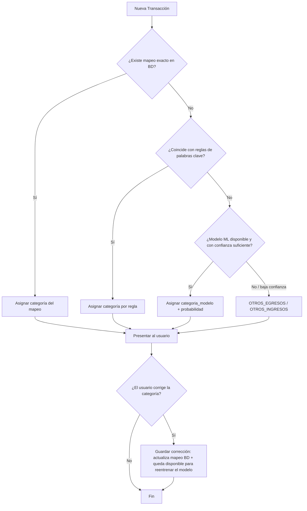

# Plan de Clasificación — Propuesta Unificada

**Proyecto:** Finance AI — Hackathon ONE Alura Latam + Oracle
**Autores:** Equipo de Backend + Equipo de Datos/Arquitectura
**Estado:** Propuesta unificada, para validar en reunión de equipo

---

## 1. Idea central

Las dos propuestas no son excluyentes — son **complementarias en cadena**. El sistema de reglas y mapeos del equipo de Backend resuelve los casos obvios de forma instantánea y sin depender de un modelo entrenado; el modelo de ML del equipo de Datos resuelve los casos que ni un mapeo exacto ni una palabra clave pueden cubrir. Se combinan en una **jerarquía de 4 niveles**, de mayor a menor precisión/velocidad:

---

## 2. Los 4 niveles

| Nivel | Mecanismo | Origen | Cuándo actúa |
|---|---|---|---|
| 1 | Mapeo exacto en BD (`transaction_category_mappings`) | Backend | Descripción normalizada ya fue clasificada antes por algún usuario |
| 2 | Reglas de palabras clave (`CategoryRule`) | Backend | No hay mapeo, pero la descripción contiene una palabra clave conocida |
| 3 | Modelo ML entrenado (Scikit-Learn) | Datos | No hay mapeo ni palabra clave — el modelo generaliza sobre texto nunca visto |
| 4 | Fallback `OTROS_EGRESOS` / `OTROS_INGRESOS` | — | Ninguno de los anteriores tuvo éxito o confianza suficiente |

**Nota de diseño:** el nivel 3 se inserta *antes* del fallback que ya existía en el código del backend (`return Category.OTHER_EXPENSE`), no lo reemplaza — es un cambio incremental sobre lo que el equipo de Backend ya construyó, no una reescritura.

---

## 3. Base de datos unificada

Se mantienen ambas piezas, porque responden preguntas distintas:

- **`transaction_category_mappings`** (propuesta de Backend): mapeo global, rápido, por descripción normalizada — beneficia a todos los usuarios apenas alguien corrige una vez.
- **`categoria_modelo` / `categoria_usuario` / `metodo_vinculacion`** (propuesta de Datos): trazabilidad fina por transacción y por usuario — necesaria para poder auditar y para construir el dataset de reentrenamiento del modelo.

Cuando el nivel 3 (modelo) clasifica una transacción, el resultado se guarda como `categoria_modelo` con su `probabilidad`. Cuando el usuario corrige cualquier categoría (venga del nivel 1, 2 o 3), esa corrección:
1. Actualiza/crea el mapeo en `transaction_category_mappings` (beneficio inmediato, para todos los usuarios)
2. Queda registrada con trazabilidad completa (usuario, transacción, categoría anterior/nueva) como insumo para el próximo reentrenamiento del modelo

---

## 4. Normalización de texto (pieza compartida)

Ambos equipos llegaron independientemente a la misma conclusión al analizar cartolas reales — esta etapa es única y se comparte entre los niveles 1, 2 y 3:

- Convertir a mayúsculas
- Quitar tildes y caracteres especiales
- Eliminar números, fechas o códigos transaccionales variables
- Colapsar espacios múltiples

---

## 5. Flujo con el frontend (sin cambios respecto a la propuesta de Backend)

1. Se sube la cartola → cada transacción pasa por los 4 niveles → se guarda con su categoría sugerida y de dónde vino (mapeo / regla / modelo / fallback).
2. El frontend muestra la lista con la categoría sugerida y un selector para corregirla.
3. Al corregir, se llama `PUT /api/transactions/{id}/category` → dispara la actualización del mapeo y el registro para reentrenamiento.

---

## 6. Qué construye cada equipo

| Componente | Responsable |
|---|---|
| Tabla `transaction_category_mappings`, `CategoryRule`, `CategoryClassifierService` (niveles 1, 2 y 4) | Backend |
| Modelo entrenado, serialización, endpoint/servicio de inferencia (nivel 3) | Datos |
| Integración de los 3 niveles en un único punto de entrada (`classify()`) | Backend, con la interfaz que exponga Datos |
| Trazabilidad `categoria_modelo`/`categoria_usuario`/`metodo_vinculacion` | Datos (ya en `schema.sql`) |
